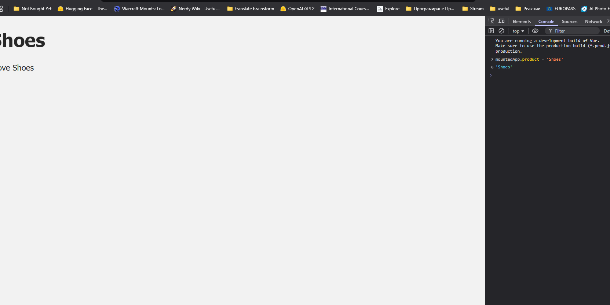
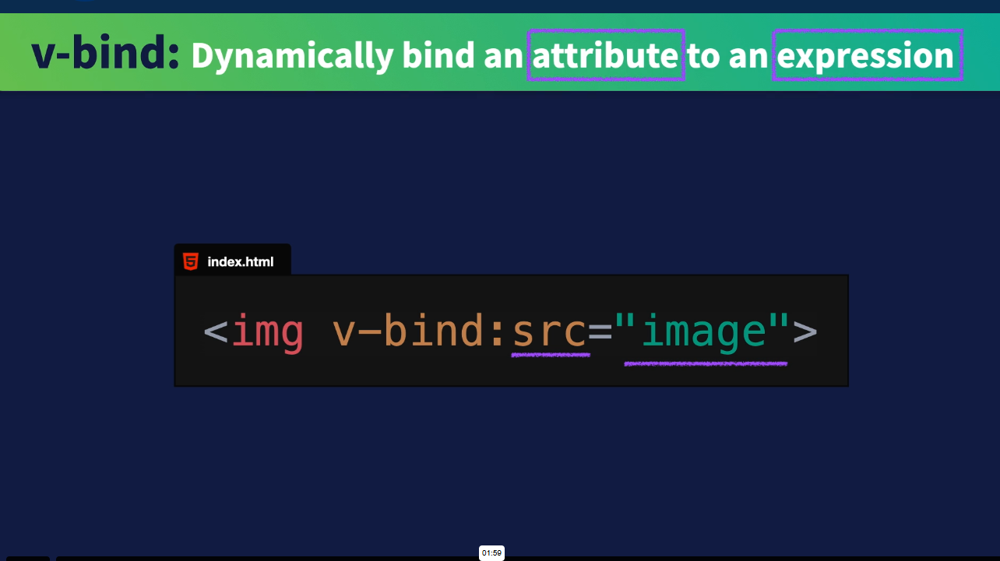
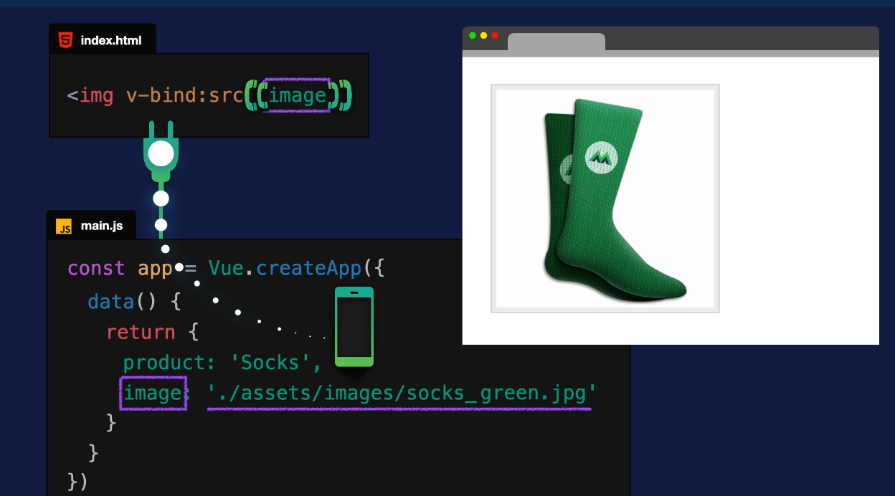
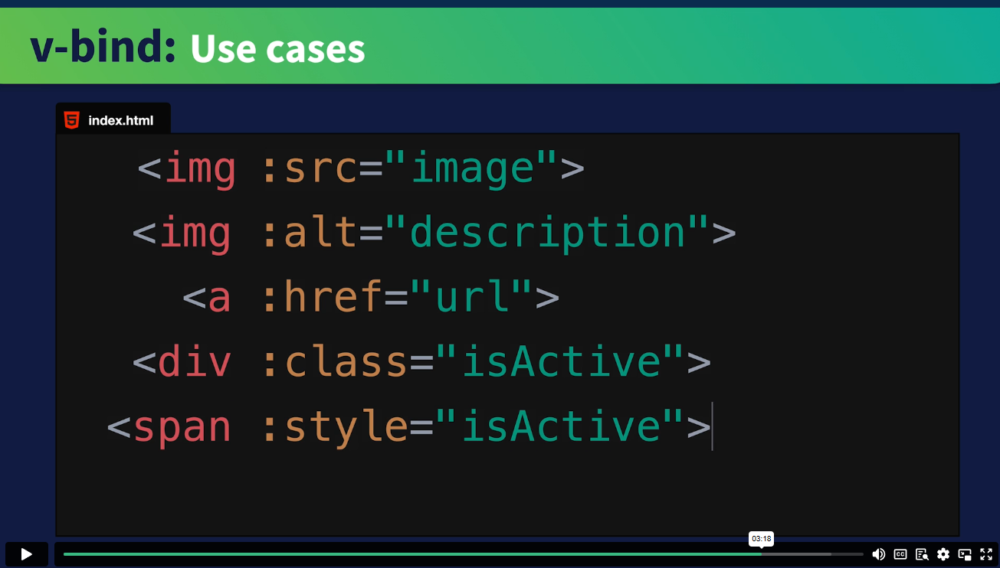
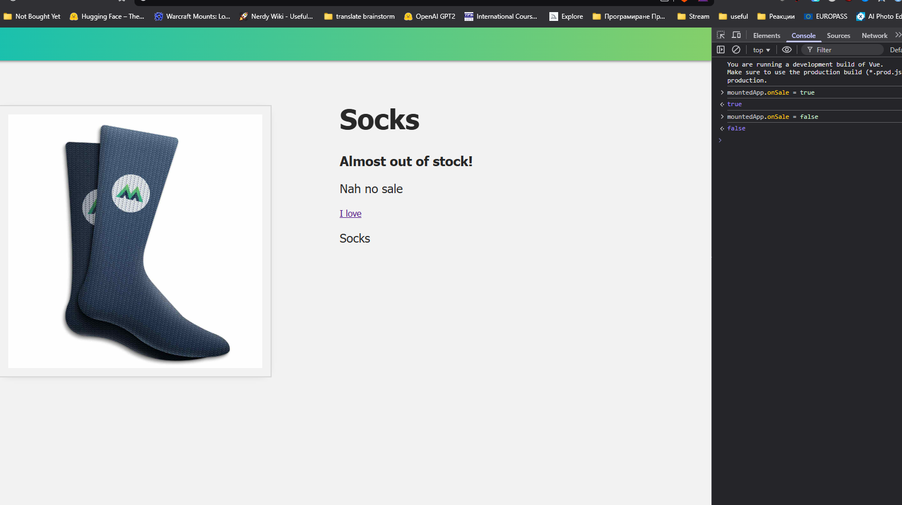
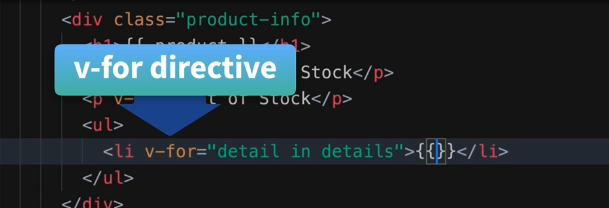
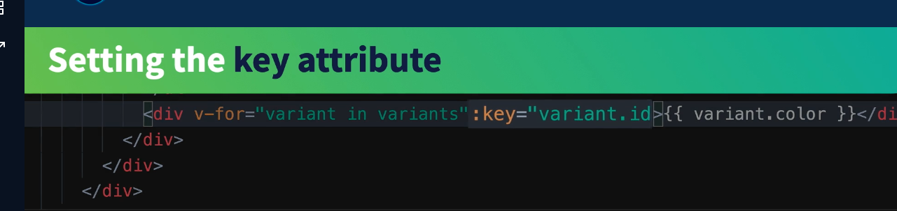
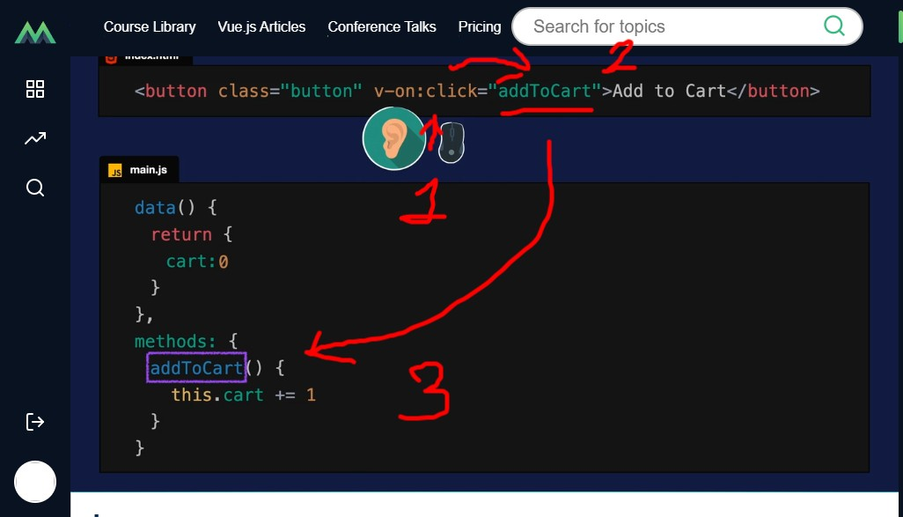

###  [Intro to Vue 3](https://www.vuemastery.com/courses/intro-to-vue-3/)
> learning path from https://www.vuemastery.com/courses/

> [To Find Vue Script from CDN](https://vuejs.org/guide/quick-start.html#using-vue-from-cdn)

> https://vuejs.org/guide/quick-start#using-vue-from-cdn

> https://developer.mozilla.org/en-US/docs/Web/JavaScript/Guide/Modules 
### [Creating a New App](https://www.vuemastery.com/courses/intro-to-vue-3/creating-the-vue-app-vue3)
>> using `mountedApp.product = 'Shoes'`  in F12 Console changes the data and updates it automatically
>>>
###  Attribute Binding
>>>> 
>- how do we bind src to image? -> v-bind:src="image" - 💡this is the v-bind directive - we created a bond between the attribute "image" & the data itself inside it in the app 
>>> `v-bind` <-  (dynamically bind)  `:` <- (the : serves as the glue) `src` <- (attribute) `"image"` <- value of the expression 
>> 
> 
### 4 [Conditional Rendering](https://www.vuemastery.com/courses/intro-to-vue-3/conditional-rendering-vue3) 
- [Docs](https://vuejs.org/guide/essentials/conditional.html)
>- `<p` **v-show**=`"inStock">`In Stock`</p>` 
>- `v-if` it is `in stock` 
>- `show` `'in stock'`
>>- can be achieved with `v-if` as well
>>>-  `<p` **v-if**=`"inStock">`In Stock`</p>` 
>>- `v-if` it is in stock - show `'in stock'`
>- `<p` **v-else**`>` Out of Stock `</p>`
> 
### [List Rendering](https://www.vuemastery.com/courses/intro-to-vue-3/list-rendering-vue3) 
- [DOCS](https://vuejs.org/guide/essentials/list.html)
- `v-for`
  
- key attribute - gives each DOM element a unique **:key** 🗝️ 
```
<div v-for="variant for variants" :key="variant.id">
```
  

- removed this piece of html, cause clutter 
```
<!-- On Sale or Off-->
<p v-show="onSale"> On Sale </p 
```
- another one
```
<!-- exercise to add a url to the data object and then use v-bind the url to an anchor tag's href attribute. -->
    <a v-bind:href="url" target="_blank"> 💗⭐
        <!--{{}} will display the same and update simultaneously on multiple places -->
        <p>
            {{ product }}
        </p>
    </a>
```
- toggle on/off
```
<!-- ON/OFF BUTTON -->
<button @click="awesome = !awesome">ON/OFF</button>
    <h1 v-if="awesome">Clean socks!</h1>
    <h1 v-else>Stinky socks 😢</h1>
```
= [lists guide from VueJs](https://vuejs.org/guide/essentials/list.html)
- to-do app component tree
```
App (root component)
├─ TodoList
│  └─ TodoItem
│     ├─ TodoDeleteButton
│     └─ TodoEditButton
└─ TodoFooter
   ├─ TodoClearButton
   └─ TodoStatistics`
```
Mounting the App​
An application instance won't render anything until its .mount() method is called. It expects a "container" argument, which can either be an actual DOM element or a selector string:
>html
```html
<div id="app"></div> 
```
>javascript
```javascript
 app.mount('#app') 
 ```
-`v-for`can also take an integer. In this case it will repeat the template that many times, based on a range of 1...n.
- ```an v-for="n in 10">{{ n }}</span>```
- [v-for with vi-if](https://vuejs.org/guide/essentials/list.html#v-for-with-v-if)
- [Maintain state with :key](https://vuejs.org/guide/essentials/list.html#v-for-with-v-if)
- [key attribute](https://vuejs.org/api/built-in-special-attributes.html#key)
- [maintain state with key](https://vuejs.org/guide/essentials/list#maintaining-state-with-key)
```
  <!-- button added in L6 -->
       <button class="button" v-on:click="cart += 1">Add to Cart</button>   
  <!-- cart '+=' <- this increments 1 to cart when the button is activated (turned on -- v-on )-->
```
- 
- 
- 
- v-on is also '@' for short just like v-bind is with ':'
- i wrote this one in the prev lesson from the docs as an example , now removing it for clutter
```
  <!-- counter for quantities later -->
  <div>
    <button @click="count++">{{ count }}</button>
  </div>
```
- remove cart button exercise to L6
```
<!-- remove from cart button added as an exercise -->
<button class="button" v-on:click="removeFromCart"> -1 from Cart</button>   
<!-- cart '+=' <- this increments 1 to cart when the button is activated (turned on -- v-on )-->
```
> declutter
```

                      <ul>
                        <template v-for="item in items">
                          <li>{{ item.msg }}</li>
                          <li class="divider" role="presentation"></li>
                        </template>
                      </ul>
```

```
   <template v-for="todo in todos" :key="todo.name">
                        <li v-if="!todo.isComplete">
                          {{ todo.name }}
                        </li>
                      </template>
```

```
                      <!-- exercise to do sizes, I did quantities too -->
                      <ul>
                      <li v-for="size in sizes" :key="size.quantity">
                       Size: {{ size.size }} Quantity: {{ size.quantity }}
                      </li>
                      </ul>
```